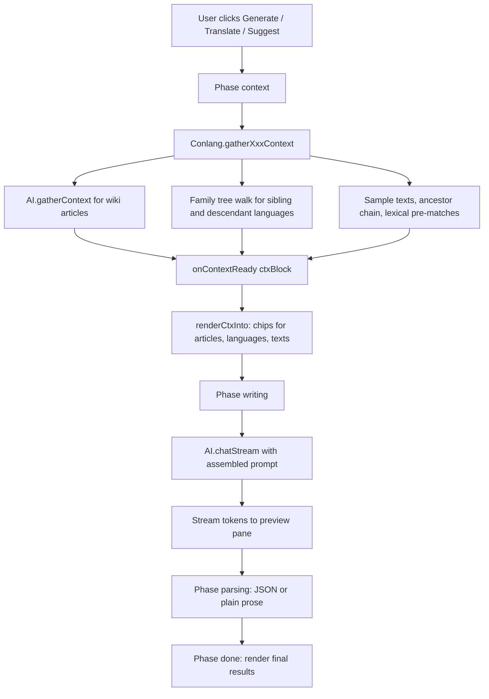

# Conlang AI Tools — Context Gathering Phase

Status: Planned
Branch: feature/conlang-context (suggested)

Bring the three conlang AI tools (Generate Vocabulary, Translate Sentence,
Suggest Etymology) up to feature-parity with the article generator's
context-gathering UX. They currently jump straight to `AI.chatStream()`
with only a static "own-language" context block; this plan adds an
explicit retrieval phase, on-screen chips showing what was retrieved, and
an optional explicit related-article picker per tool.

---

## 1. Today vs. target

### Today

- [`runGenerateVocabulary`](../ai-generate.html:1706),
  [`runTranslateSentence`](../ai-generate.html:1842),
  [`runSuggestEtymology`](../ai-generate.html:1928) each:
  - Build a static block via [`buildConlangContext()`](../ai-generate.html:1654)
    (phonology, grammar, romanization).
  - Optionally append a sample lexicon string via
    [`buildLexiconSummary()`](../ai-generate.html:1679).
  - For etymology only, append the **immediate** parent language's
    sample lexicon (one level).
  - Call `AI.chatStream` directly with an inline system+user prompt.
  - Stream raw text into a `<pre>` and parse JSON at the end (or render
    prose for etymology).
- No phase indicator, no retrieval step, no UI to show the user what is
  being passed in beyond the raw stream pane.

### Target

Match the Single tab's flow ([`runSingle()`](../ai-generate.html:791)):

```
Click → Phase: context → Phase: writing → Phase: parsing → Phase: done
              ↓                ↓
        chips render      tokens stream
```

Each tool gains:

1. A `Phase: context` step that runs **before** the model call.
2. A retrieval block returned from a new `Conlang.gatherXxxContext(spec)`
   helper, passed through `onContextReady(ctx)` so the page can render
   chips.
3. A streaming wrapper in `js/ai.js` (`AI.generateVocabularyStreaming`,
   `AI.translateSentenceStreaming`, `AI.suggestEtymologyStreaming`) that
   owns the prompt assembly and chat call — mirrors
   [`generateArticleStreaming`](../js/ai.js:513).
4. UI: `ai-progress-wrap` + `ai-ctx-wrap` + `ai-stream-wrap` blocks per
   tool, plus an explicit related-article picker (the `initRelatedPicker`
   widget already used by the Single tab).

---

## 2. What "context" means per tool

| Tool | Auto-gathered | Tool-specific extras |
|---|---|---|
| Generate Vocabulary | Wiki articles matching the **semantic field + extra notes** via [`AI.gatherContext()`](../js/ai.js:455); sibling and descendant languages (shared roots, loanwords); recent sample texts | Lexicon stats: tag and POS distribution snapshot of the existing lexicon (so the model knows what's already covered) |
| Translate Sentence | Wiki articles matching the **sentence text** (proper nouns, in-universe concepts); parent + sibling lexicons; sample texts (canonical phrasing) | Lexical pre-match: lexicon entries whose `word` or `romanization` appears verbatim in the sentence (case-insensitive) — fed in as a "direct hits" list so the model uses them rather than coining duplicates |
| Suggest Etymology | Full ancestor chain (not just one level) walked via [`Conlang.getAncestors()`](../js/conlang.js:52); sibling languages' lexicon entries whose `definitions[]` overlap with the target word's definitions (cognate candidates); wiki articles matching the word's definitions | Peer etymologies: 3–5 existing `etymology` paragraphs from other entries in this language, for tone and style consistency |

All three share the **own-language base block**: phonology, romanization,
phonotactics, grammar notes, status, native name. That stays in
`buildConlangContext()` and is reused unchanged.

---

## 3. Module split

| File | Change |
|---|---|
| `js/conlang.js` | Add 3 new gatherers (described in §4), each returning a structured ctx object. |
| `js/ai.js` | Add 3 streaming wrappers (described in §5). Move inline prompt assembly out of `ai-generate.html` into these. Add 3 prompt-override slots to `DEFAULT_PROMPTS` so users can edit them in AI settings. |
| `ai-generate.html` | Add per-tool progress + context + stream UI; extend `renderCtxInto()` to handle the new `relatedLanguages` and `sampleTexts` sections; refactor the three `run*` functions to call the new wrappers; add 3 related-article pickers and per-tool state. |
| `plans/conlang-feature.md` | Cross-link this document. |

No changes to data shape, storage, or the existing `Conlang.findEntry`,
`Conlang.findBacklinks`, `parseConlangRefs` etc.

---

## 4. New gatherers in `js/conlang.js`

All three return a plain object suitable for both prompt assembly and
the on-page chip render. Heavy lifting (semantic search) is delegated to
`AI.gatherContext()`.

### 4.1 `Conlang.gatherVocabContext(spec)`

```jsonc
// spec
{
  "langId":       "lang_…",
  "semanticField":"weapons",
  "notes":        "ceremonial only",
  "relatedIds":   ["art_…"],     // explicit picker
  "topK":         5
}

// returns
{
  "language": { /* full lang object */ },
  "articles": {                  // shape compatible with renderCtxInto
    "explicit": [ { "id","title","summary","snippet" } ],
    "semantic": [ { "id","title","summary","snippet","score" } ],
    "query":    "weapons\nceremonial only"
  },
  "relatedLanguages": [
    { "id","name","relation":"parent|sibling|descendant","sampleSize":N }
  ],
  "sampleTexts":    [ { "title","text","translation" } ],   // up to 3
  "lexiconStats":   { "totalWords":137, "byPos":{"noun":80,"verb":40},
                      "topTags":["element","common"] }
}
```

Implementation notes:

- Build query string `[semanticField, notes].filter(Boolean).join('\n')`.
- Call `AI.gatherContext({ title: semanticField, guidance: notes,
  relatedIds, topK })` for `articles`.
- Walk family tree: parents via `getAncestors`, siblings via
  `DB.languages.filter(l => l.parentId === lang.parentId && l.id !== lang.id)`,
  descendants via `getDescendants`. Cap at ~5 entries total.
- `sampleTexts`: take `lang.sampleTexts.slice(0, 3)` (full text + translation).
- `lexiconStats`: cheap scan of `lang.lexicon`.

### 4.2 `Conlang.gatherTranslationContext(spec)`

```jsonc
// spec
{
  "langId": "lang_…",
  "direction": "en-to-lang" | "lang-to-en",
  "sentence":  "The king walked into the temple.",
  "relatedIds": ["art_…"],
  "topK": 5
}

// returns
{
  "language": { … },
  "articles": { explicit, semantic, query: sentence },
  "relatedLanguages": [ … ],            // parent + siblings only (translation rarely needs descendants)
  "sampleTexts":      [ … ],            // up to 5
  "ancestorChain":    [ "ProtoTzenki","ProtoFooic" ],   // names only, for prompt mention
  "lexicalPreMatches": [                // entries already in the lexicon that appear in the sentence
    { "id","word","romanization","ipa","partOfSpeech","definitions": [ … ] }
  ]
}
```

Implementation notes:

- Lexical pre-match: tokenize the sentence on `/\W+/`, lowercase, then
  match each token against `lexicon[].word` and `lexicon[].romanization`
  (and English `definitions[]` for the `en-to-lang` direction). Dedup by
  entry id.
- Articles query is the full sentence; `AI.gatherContext()` handles
  embedding vs. lexical fallback.

### 4.3 `Conlang.gatherEtymologyContext(spec)`

```jsonc
// spec
{
  "langId":  "lang_…",
  "wordId":  "lex_…",
  "relatedIds": ["art_…"],
  "topK": 4
}

// returns
{
  "language": { … },
  "entry":    { /* the lexicon entry being annotated */ },
  "articles": { explicit, semantic, query: definitions.join(', ') },
  "ancestorChain": [
    { "id","name","sampleLexicon": "kalo: fire | …" }   // each ancestor with a 30-entry sample
  ],
  "siblingCognates": [
    { "langId","langName","entries":[ { word, definitions, etymology } ] }
  ],
  "sampleTexts":     [ … ],              // up to 2
  "peerEtymologies": [ "From proto-Tzenki *kalo-…", … ]   // 3–5 existing etymologies in this lang
}
```

Implementation notes:

- Walk full ancestor chain (already exposed via `Conlang.getAncestors`).
  For each ancestor, attach a 30-entry sample built with the existing
  `buildLexiconSummary` shape (move that helper to `Conlang` so it can
  be shared).
- Sibling cognates: for each sibling language (same `parentId`), filter
  its lexicon to entries whose `definitions[]` share at least one
  lowercase token with the target entry's `definitions[]`. Cap at 5
  siblings, 5 cognates each.
- `peerEtymologies`: from this language's own lexicon, pick up to 5
  entries with non-empty `etymology` other than the target entry.

---

## 5. New streaming wrappers in `js/ai.js`

Each wrapper follows the exact contract of
[`generateArticleStreaming`](../js/ai.js:513):

```
phase: 'context'  → onContextReady(ctx)
phase: 'writing'  → AI.chatStream(messages, opts, onChunk)
phase: 'parsing'  → JSON.parse / cleanup
phase: 'done'     → onComplete(result)
```

### 5.1 `AI.generateVocabularyStreaming(spec, callbacks)`

- spec passes through to `Conlang.gatherVocabContext`.
- `messages` built from new `prompts.vocabSystemPrompt` +
  `prompts.vocabUserTemplate` (placeholders: `{contextBlock}`,
  `{relatedLangsBlock}`, `{sampleTextsBlock}`, `{lexiconStatsBlock}`,
  `{semanticField}`, `{count}`, `{notes}`, `{existingWordsCsv}`).
- Streams JSON `{ "words": [ … ] }`. Use the existing
  `_ProgressiveJsonExtractor` (or a small array variant — see
  `generateTimelineEventsStreaming` at [js/ai.js:670](../js/ai.js:670))
  to fire `onWord(word, idx)` per completed object.
- `onComplete({ words, contextUsed })`.

### 5.2 `AI.translateSentenceStreaming(spec, callbacks)`

- spec passes through to `Conlang.gatherTranslationContext`.
- Prompt template uses `{lexicalPreMatchesBlock}` + `{ancestorChainBlock}`.
- Streams JSON
  `{ "translation","gloss","words":[…],"unknown":[…] }`.
  Single-object — reuse the article extractor with custom field hooks
  if useful, otherwise just buffer and parse at the end via existing
  `parseJsonFromAi`.
- `onPartial(partialObj)` (optional) for live preview;
  `onComplete({ translation, gloss, words, unknown, contextUsed })`.

### 5.3 `AI.suggestEtymologyStreaming(spec, callbacks)`

- spec passes through to `Conlang.gatherEtymologyContext`.
- Streams **plain prose** (not JSON), so `onRawDelta(delta, accum)` is
  the primary hook; no JSON parser. Match current behavior.
- `onComplete({ text, contextUsed })`.

### 5.4 Prompt-override slots

Add to `_DEFAULT_PROMPTS_BUILDER()` in [js/ai.js](../js/ai.js:60):

- `vocabSystemPrompt`, `vocabUserTemplate`
- `translateSystemPrompt`, `translateUserTemplate`
- `etymologySystemPrompt`, `etymologyUserTemplate`

Resolved via the existing override-merge in
[`AI.getConfig()`](../js/ai.js:75) so they show up in the AI settings
prompt editor automatically (assuming the editor enumerates
`DEFAULT_PROMPTS` keys).

---

## 6. UI changes in `ai-generate.html`

### 6.1 Per-tool progress / context / stream blocks

Insert above each existing `cl-*-results` div:

```html
<div id="cl-gv-progress" class="ai-progress-wrap" style="display:none;">
  <div class="ai-progress-bar"><div class="ai-progress-fill indeterminate"></div></div>
  <div id="cl-gv-phase" class="ai-phase-line">
    <span class="ai-spinner"></span><span id="cl-gv-phase-text">Working…</span>
  </div>
</div>

<div id="cl-gv-context" class="ai-ctx-wrap" style="display:none;"></div>

<!-- existing #cl-gv-stream becomes the streaming preview pane -->
<!-- existing #cl-gv-results stays where it is for the final table -->
```

Same pattern for `cl-tr-*` and `cl-et-*`. All CSS classes already exist
([`ai-progress-wrap`, `ai-ctx-wrap`, etc. in css/main.css](../css/main.css:1)).

### 6.2 Related-article pickers

Add a small picker block to each tool's form grid (mirrors
[`s-related-*`](../ai-generate.html:264)):

```html
<div class="aig-form-row full">
  <label>Related Articles <span class="hint">(optional, pinned context)</span></label>
  <div id="cl-gv-related-chips" class="ai-related-chips"></div>
  <input id="cl-gv-related-search" class="field-input" placeholder="Search articles…">
  <div id="cl-gv-related-results" class="ai-related-results"></div>
</div>
```

State extension:

```js
State.clGvRelatedIds = [];
State.clTrRelatedIds = [];
State.clEtRelatedIds = [];
```

Wire in `wireConlangTab()` using the existing `initRelatedPicker(...)`.

### 6.3 Extending `renderCtxInto`

Make the function additive by checking for new optional keys:

```js
if (Array.isArray(ctx.relatedLanguages) && ctx.relatedLanguages.length) {
  out += `<div class="ai-ctx-heading">Related languages (${ctx.relatedLanguages.length})</div>`;
  out += `<div class="ai-ctx-row">${
    ctx.relatedLanguages.map(l =>
      `<span class="ai-ctx-chip lang ${l.relation}" title="${escHtml(l.relation)}">${escHtml(l.name)}</span>`
    ).join('')
  }</div>`;
}
if (Array.isArray(ctx.sampleTexts) && ctx.sampleTexts.length) {
  out += `<div class="ai-ctx-heading">Sample texts (${ctx.sampleTexts.length})</div>`;
  out += `<div class="ai-ctx-row">${
    ctx.sampleTexts.map(t =>
      `<span class="ai-ctx-chip text" title="${escHtml(t.translation || t.text)}">${escHtml(t.title || 'Untitled')}</span>`
    ).join('')
  }</div>`;
}
```

The current article + timeline callers do not set these keys, so they're
unaffected. Add minor CSS for `.ai-ctx-chip.lang` and `.ai-ctx-chip.text`
variants (re-use the existing chip palette).

### 6.4 Refactored runners

Each `run*` becomes thin: collect form values, show progress, call the
new `AI.*Streaming`, render results in `onComplete`. The current
[`buildConlangContext`](../ai-generate.html:1654),
[`buildLexiconSummary`](../ai-generate.html:1679), and
[`parseJsonFromAi`](../ai-generate.html:1688) helpers either move to
`js/ai.js` (used by wrappers) or are kept as small renderers if still
called by the page.

---

## 7. Flow diagram



---

## 8. Backward compatibility

- `AI.generateArticleStreaming`, `AI.generateTimelineEventsStreaming`,
  `AI.gatherContext` — untouched.
- `Conlang` public surface — additive only.
- `renderCtxInto` — additive (new keys optional).
- `buildConlangContext` / `buildLexiconSummary` — moved to `Conlang`
  namespace; old call sites in `ai-generate.html` updated in the same
  pass.
- Existing prompts in `DB.settings.ai.prompts` — not invalidated; new
  keys are read with default fallbacks.

---

## 9. Test matrix

Cover these manually after implementation:

| Scenario | Vocab | Translate | Etymology |
|---|---|---|---|
| AI configured with embeddings, related articles exist | ✓ | ✓ | ✓ |
| AI configured but embeddings disabled (lexical fallback) | ✓ | ✓ | ✓ |
| Language has parent + siblings + descendants | ✓ | ✓ | ✓ |
| Language is orphan (no parent, no siblings) | ✓ | ✓ | ✓ |
| Language has zero sample texts | ✓ | ✓ | ✓ |
| Lexicon is empty | ✓ | ✓ (lexicalPreMatches empty) | n/a (entry required) |
| Sentence contains only known words | n/a | ✓ (preMatches >0) | n/a |
| Sentence contains zero known words | n/a | ✓ (preMatches []) | n/a |
| Explicit related-article picker has 0 / 1 / 3 entries | ✓ | ✓ | ✓ |

For each: confirm the phase line cycles correctly, context chips render,
the stream pane fills, and the final results render in the right place.

---

## 10. Open extensions (not in this pass)

- A settings toggle to disable context gathering for conlang tools
  (mirroring `topK`). Out of scope; revisit if users complain about
  latency.
- Caching `Conlang.gather*Context` results by `(langId, query)` for
  rapid re-runs.
- Showing the *prompt that will be sent* in a collapsible "advanced"
  panel — useful for prompt-engineering, but adds noise.
